# Large Rocks Mapping — Swisstopo × EPFL ECEO

This repository provides a tool for detecting large rock formations (≥5×5×5 m) in Switzerland using high-resolution RGB aerial imagery (swissIMAGE) and digital elevation models (swissALTI3D). 
The scripts in this repository were developed during the PhD of V. Zermatten through the Bachelor project of  [A. Rufer](https://github.com/alexs-rufer/large-rocks-mapping), and the work of [D. Gasmi](https://github.com/DoniaGasmii/switzerland_nationwide_rock_detection), and   [E. Thomas](https://github.com/evanjt/large-rocks-mapping), in collaboration with the Federal Office of Topography [swisstopo](https://www.swisstopo.admin.ch/) and the [ECEO Lab](https://www.epfl.ch/labs/eceo/).


# Pipeline

<p align="center">  </p>


All scripts related to this project are available in the current repository. Input data (swissIMAGE and swissAlti3D) are automatically downloaded with the scripts. 
Other files are available to download : 
- [best model weights [50MB]](models/best.pt)
- [swisstopo rock annotations (gpkg) [<1MB]](swisstop_large_rocks_annotations.gpkg)
- [Rock detections for Switzerland (zip)[30MB]](all_rock_detection.zip) 
- [Technical report (see below)](rock_detection_report.pdf)


## Environment Setup


Before running the scripts, make sure to install the necessary dependencies using the provided Conda environment file:
```
conda env create -f environment.yaml
conda activate large-rocks
```

This environment includes Python 3.11+, PyTorch, Ultralytics YOLO, OpenCV, tifffile, and other dependencies required for inference. It also requires  [uv ](https://docs.astral.sh/uv/) as a Python package manager, GDAL CLI tools (`gdaldem`), GPU access and network access to data.geo.admin.ch.


You can download the model weights from this **[link](models/best.pt)**.

### Install

    # NVIDIA GPU
    uv sync --extra cuda

    # AMD GPU (ROCm)
    uv sync --extra rocm

### Run

The `--extra` must match the install step on every `uv run` call (`cuda` or `rocm`).

    # Specific tiles
    uv run --extra cuda large-rocks-mapping \
        --model models/active_teacher.pt --coords 2587-1133

    # Bounding box (WGS84: west,south,east,north)
    uv run --extra cuda large-rocks-mapping \
        --model models/active_teacher.pt --bbox "7.0,46.5,8.0,47.0"

    # All of Switzerland
    uv run --extra cuda large-rocks-mapping \
        --model models/active_teacher.pt --all

    # Full option reference
    uv run --extra cuda large-rocks-mapping --help

| Option | Default | Description |
|---|---|---|
| `--model` | | YOLO `.pt` weights path |
| `--output` | `detections.duckdb` | DuckDB output path |
| `--coords` | | Tile coordinate(s), repeatable (e.g. `2587-1133`) |
| `--bbox` | | WGS84 bounding box (`west,south,east,north`) |
| `--all` | `false` | Process all of Switzerland |
| `--min-elevation` | `1500` | Skip tiles below this elevation in meters, 0 to disable |
| `--device` | `auto` | PyTorch device (auto, cuda:0, cpu, etc.) |
| `--download-threads` | `8` | Parallel download workers |
| `--conf` | `0.10` | Confidence threshold |
| `--iou` | `0.70` | IoU threshold |
| `--hillshade` | `overhead` | Hillshade mode: `overhead`, `combined`, or `directional` |
| `--hillshade-az` | `315.0` | Sun azimuth in degrees (combined/directional only) |
| `--hillshade-alt` | `45.0` | Sun altitude in degrees (combined/directional only) |
| `--cache-dir` | `data/tile_cache` | Tile cache directory |
| `--cache-gb` | `10` | Max tile cache in GB, 0 to disable |
| `--max-batch-tiles` | `16` | Tiles per GPU batch |

Writes detections to DuckDB and auto-exports a GeoPackage (`.gpkg`). Processed tiles are checkpointed — re-running the same output file skips completed tiles. Downloaded tiles and STAC query results are cached on disk in `--cache-dir`.


## Model training and implementation details

The model was trained using **YOLOv8** from the [**Ultralytics**](https://www.ultralytics.com/) framework from approx. 4'000 rocks annotations from swisstopo.

- **Architecture:** YOLOv8m  
- **Image size:** 640 × 640  
- **Training framework:** PyTorch via Ultralytics  
- **Input data:** swissIMAGE RGB tiles and derived hillshade from SwissSURFACE3D  
- **Annotations:** point annotations converted to YOLO bounding boxes (15m per annotations) 
- **Batch size:** 16 
- **Epochs:** 120  
- **Optimizer:** 'auto' find best YOLOv8 optimizer (AdamW, lr=0.002, momentum=0.9) and Automatic Mixed Precision (AMP)
- **Device:** NVIDIA GPU (GeForce RTX 3090)

### Dataset split

For development, the dataset follows a standard split with 80% for training, 10% for testing and 10% for validation. 900 images without rocks covering urban areas or glaciers were added to the training set to increase the number of negative samples. We use this model outputs to compute  metrics.

The final model is trained on all annotated data  including validation and test set, and the negative samples. 

### Visualisation of samples : 

<p align="center">
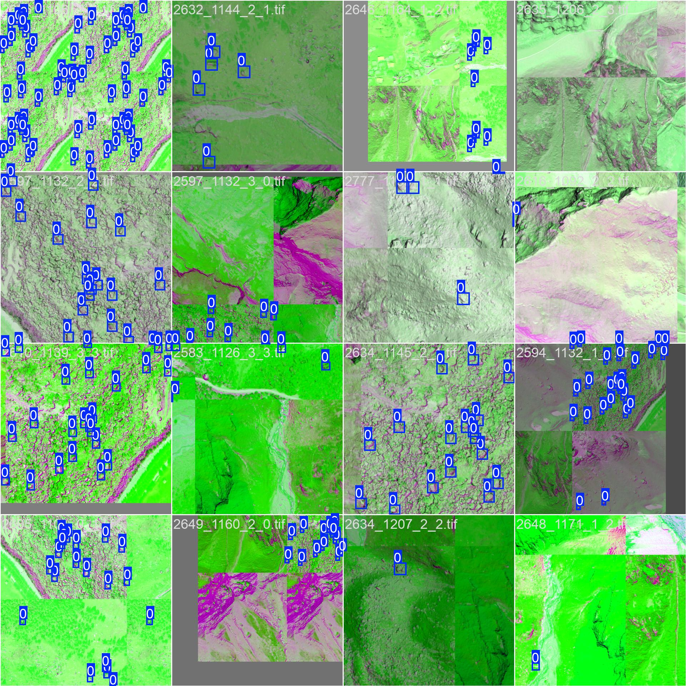<br>
Training samples with data augmentation
<br>
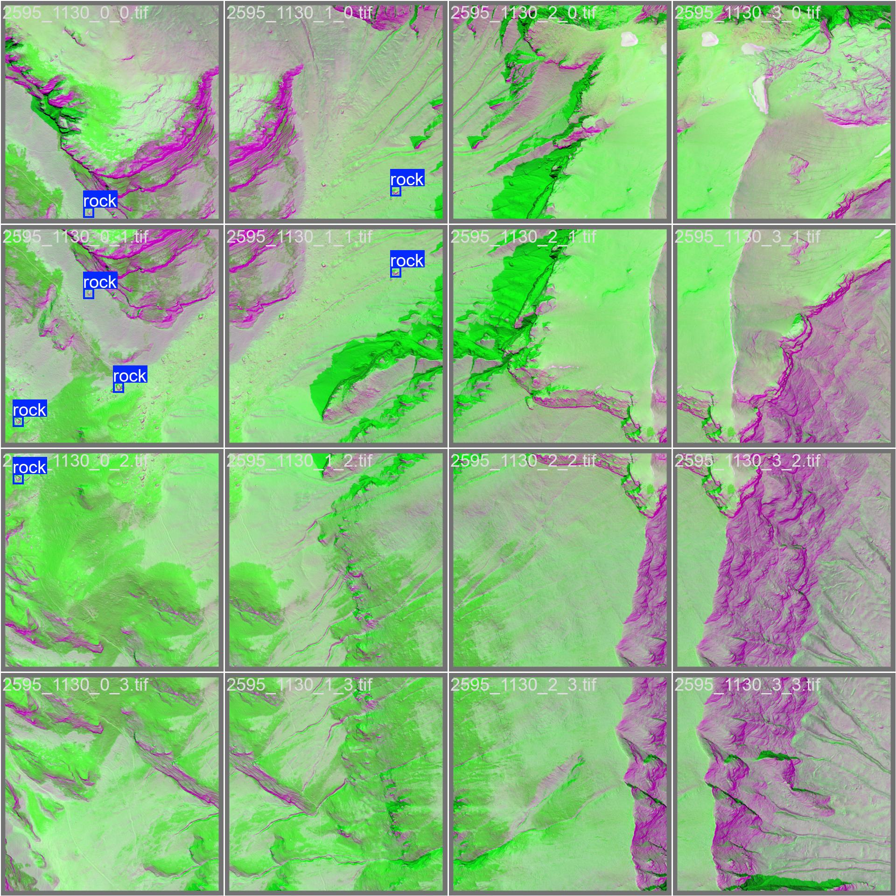
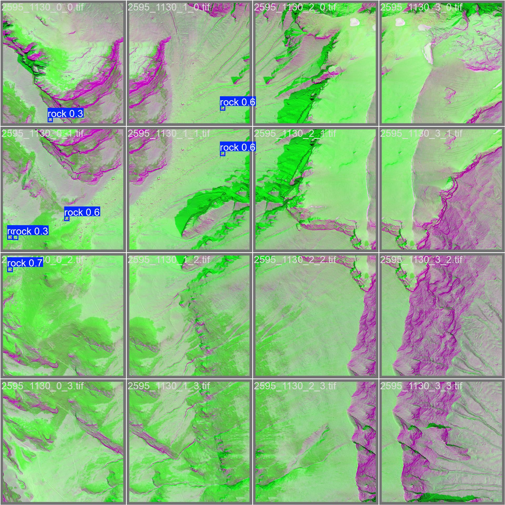
<br>
 Validation samples (left) and predictions  and confidence scores (right)</b><br><br>
</p>


## Results and Evaluation

### Qualitative evaluation 

The model was trained in alpine areas and applied to all of Switzerland. A qualitative evaluation is provided for areas without predictions.

- Overall, the model is effective at detecting rocks in a systematic manner.  Overpredictions were observed  for rocks smaller than the target size with a large shadow, rocks partially covered with grass, or bedrock that emerge sharply from the ground. 

- The model is trained to favour recall and misses a minimal number of rocks compared to the annotations provided. In the rare cases were some rocks were missed, the analysis reveals often rocks standing out in the rgb channels (swissIMAGE), but not in the swissALTI3D, thus likely below minimum size.

- Compared to previous version using swissSURFACE3D, the use of DEM (swissALTI3D) removes buildings and vegetation leading to  much fewer over-detectionin general (e.g. in urban areas, over glaciers or in forest).

### Illustration
Red dots are annotations, blue rectangles are predictions.

<p align="left">
Examples of potential over-detection (rock covered with grass):
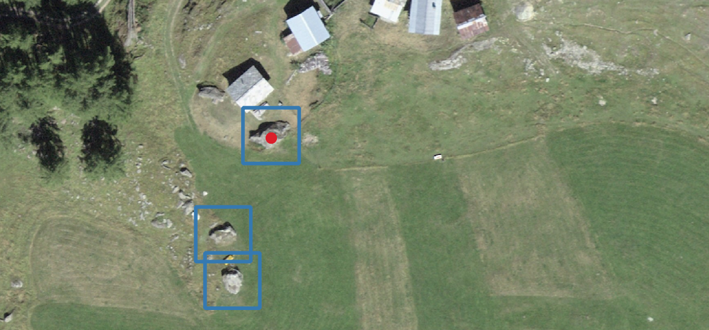
<br>
Examples of over-detection (bedrock)
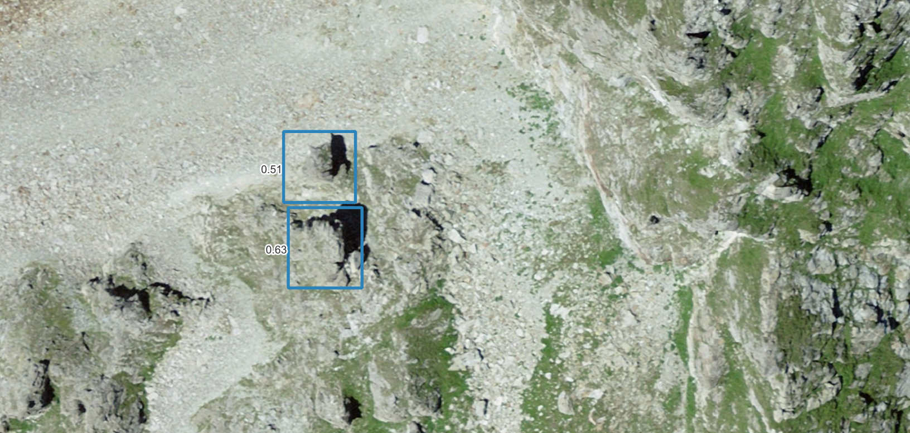<br>
Examples of over-detection   (rocks better visible in DEM than RGB):
<br>
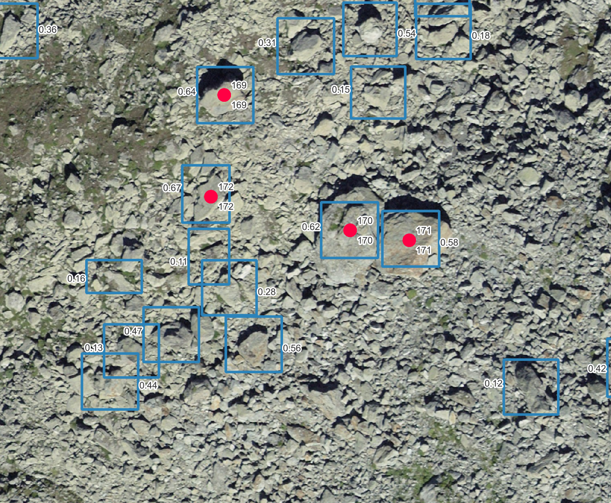
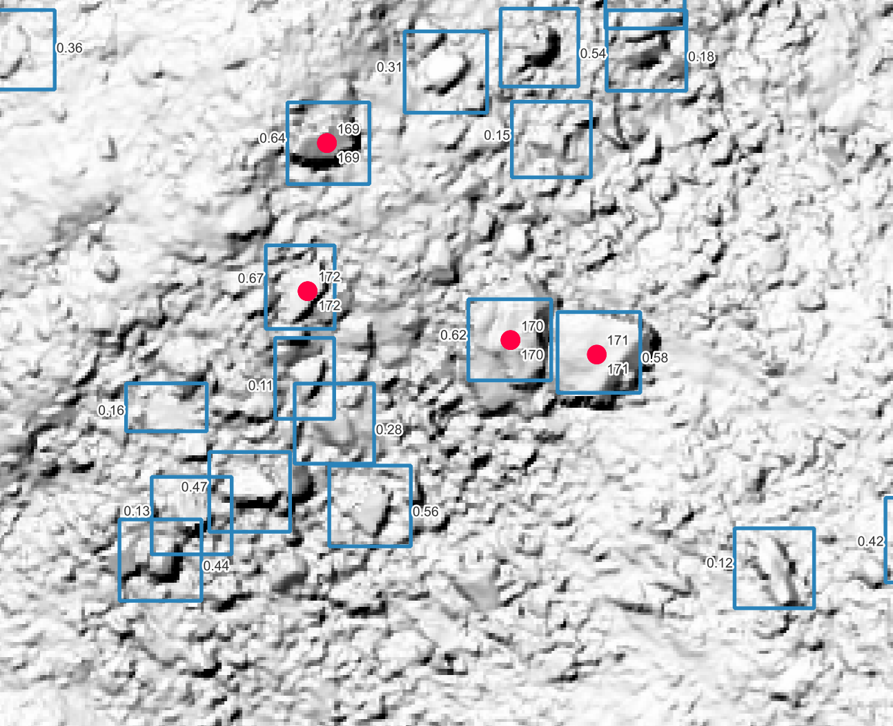
<br>
Examples of over-detection   (boats):
<br>


<br>
Examples of over-detection (boats and gold course):
<br>
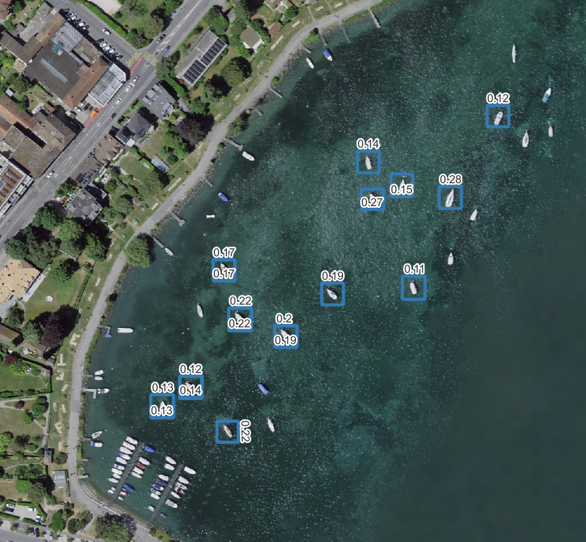
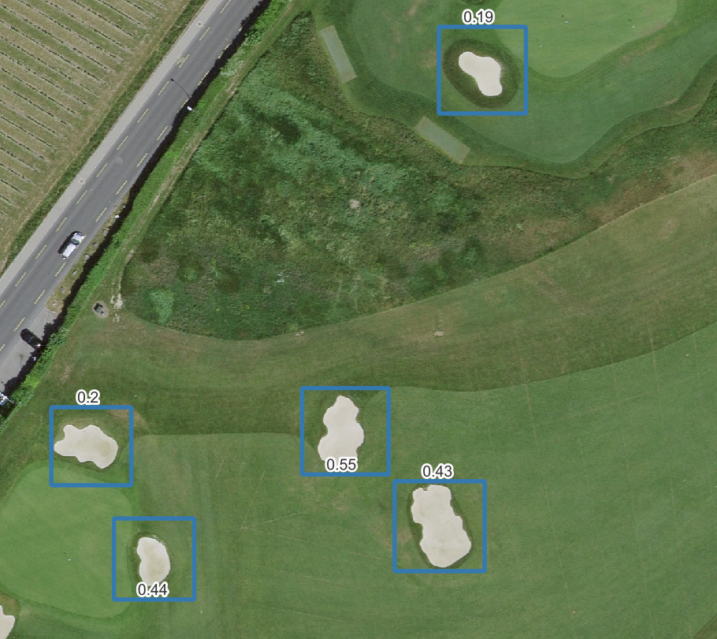
</p>


### Precision and Recall curve as a function of confidence :

The figure below shows the trade-off between finding more rocks (**recall**) and being correct (**precision**).  
<p float="left">
  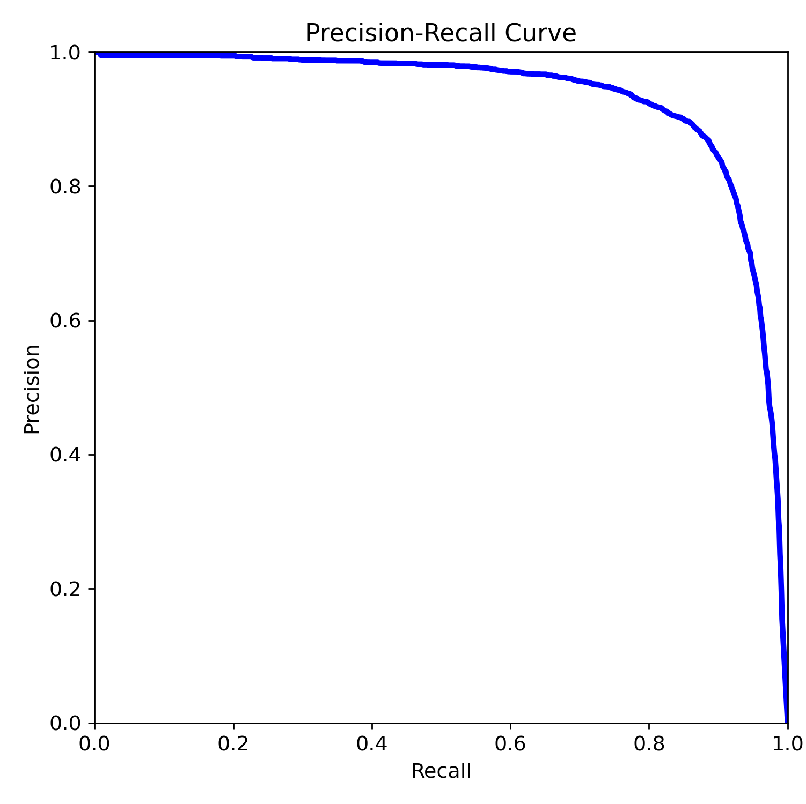
  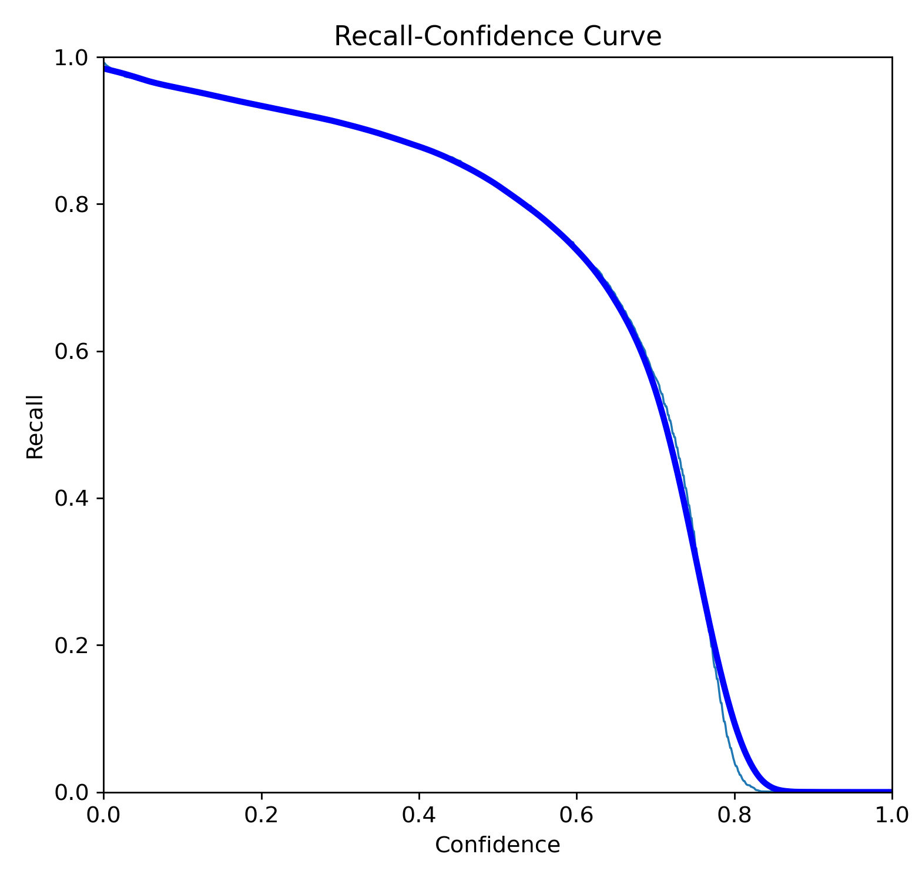
  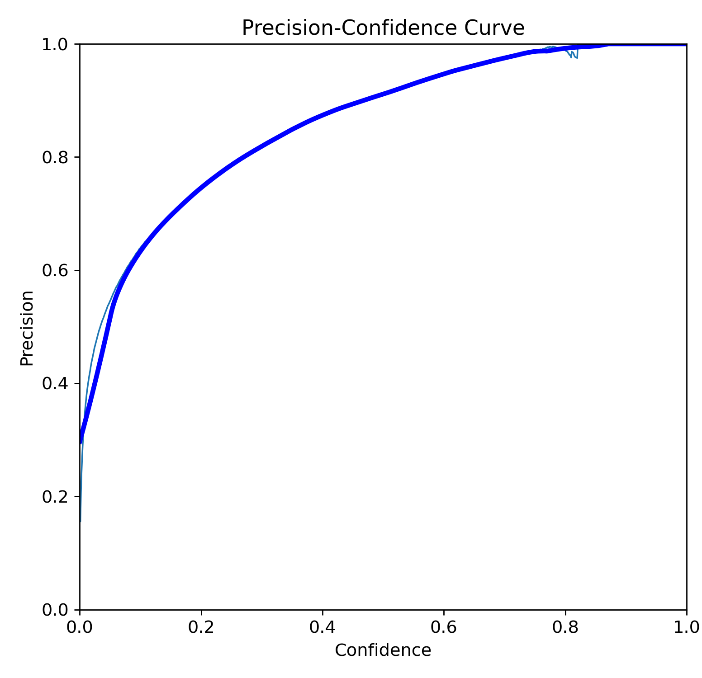
</p>

- Left — Precision vs Recall:  If the model tries to detect every possible rock, it finds more rocks but also makes more mistakes.

- Middle — Recall vs Confidence:  If we only keep **high-confidence detections** (e.g. over 60%), the model misses more rocks.

- Right — Precision vs Confidence:  Shows that when we keep only **high-confidence detections** (e.g. over 60%), predictions become very accurate.

### How to use the confidence threshold :

A high confidence threshold (e.g. 50% confidence) requires  minimal manual corrections (high accuracy).  

Then a lower detections threshold (e.g. 10-30% confidence) enables to obtain more complete predictions,   but requires more manual verification, to remove predictions that do not fulfill the criteria.

## Confusion matrix


<p align="center">  </p>


The model is evaluated on images not used for training with 327 rocks annotated by swisstopo annotators: 

- Most rocks are detected (242/327= ~74% recall). 85 rocks were missed.

- Predictions tend to  over-predicts rocks, i.e.  background is classified as rocks (141). Out of all predicted rocks (383), 242 predictions are correct rocks (242/383 = 63% precision).


**Interpretation**: Predictions are fairly complete, annotators could manually discard some excessive predictions. 


